# Assignment report

## Objective

The initial objective on first reading appeared to be to create and train a
model to use the data-sets given. This model would then be used to look
through any other data set with the same attributes in order to determine
if a patient had the risk of heart-disease.

Apparently not. In general the assignment appeared to be, on further
reading, simply asking me to perform some standard analysis on the data to
determine correlations.

## The data-sets
Data-sets are available at: 

https://archive.ics.uci.edu/ml/datasets/Heart+Disease

The raw data consists of a large number of attributes which would make it 
difficult to determine a correlation between the attributes and heart-disease.

Fortunately for us, the data-providers have processed the data to include only
14 attributes.

The attributes are as follows:

  1. Age (in years)
  2. Sex:
     - 0:female
     - 1:male
  3. Type of chest-pain:
     - 1:typical angina
     - 2:atypical angina
     - 3:non-typical pain
     - 4:asymptomatic
  4. Blood-pressure at rest (in mm of Mercury on admission to hospital)
  5. Serum cholesterol (in mg/dl)
  6. Fasting blood-sugar that is greater than 120 mg/dl:
     - 0:false
     - 1:true
  7. Electro-cardiograph results at rest:
     - 0:normal
     - 1:having ST-T wave abnormality
     - 2:showing probable or definite left ventricular hypertrophy by Estes' criteria
  8. Maximum heart rate achieved
  9. Existence of exercise induced angina:
     - 0:false
     - 1:true
  10. ST depression induced by exercise relative to rest
  11. Slope of the peak exercise ST segment:
     - 1:upsloping
     - 2:flat
     - 3:downsloping
  12. Number of major vessels coloured by flouroscopy (between 0-3)
  13. "thal" (unknown attribute):
     - 3:normal
     - 6:fixed
     - 7:reversable defect
  14. Diagnosis of heart-disease (angiographic disease status):
     - 0:diameter narrowing of <50% (diameter is sufficiently large)
     - 1:diameter narrowing of >50% (diameter is sufficiently small)

## Log

We started by defining the columns headings in a variable. We then used this
variable when loading the first data-set (Cleveland) into a data-frame called
'df1_raw', which we checked dimensions on and did a head of the data.

Next, we started to assign data-types to each of the columns, assigning the
data-types one-by-one. Unfortunately, some assignments didn't happen. 
Examination showed that there were columns where missing information was 
denoted with a '?', which were preventing setting data-types to numeric values.

These rows of missing data were removed for each data-type assignment, until
the complete assignment of data-types to columns were complete.

Next, we attempted to load in data from the other three data-sets. However,
it seems that all of the rows were missing at least one column of data,
resulting in all the data sets having to be discarded.

A quick view of the 'reprocessed.hungarian.data' determined, that the missing
values were simply replaced with '-9', which made the data still incomplete.

The last part was in visually representing the data, for which we used the
plot() function implicit to Pandas data-frames to create histograms.

Since the required label is 'Diagnosis' we grouped the rows by that and plotted
graphs for each of the columns.

We made two graphs for each column, one for histograms, one for scatterplots.

## Question: Logistics Regression Model

Question:

"Do you think whether you can use logistics regression model to 
predict the heart disease. Explain."

Answer: 

Yes. In this data-set, the dependent variable is binary, and the
independent variables are either binary or continious. However for some of the
columns, this model won't work out.

## Histograms

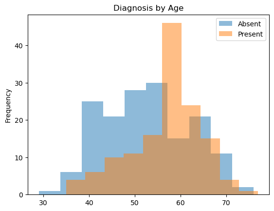
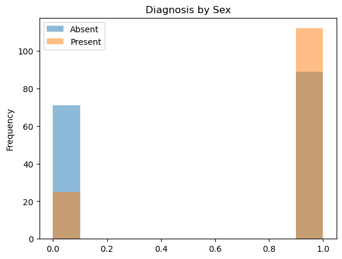
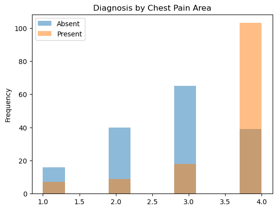
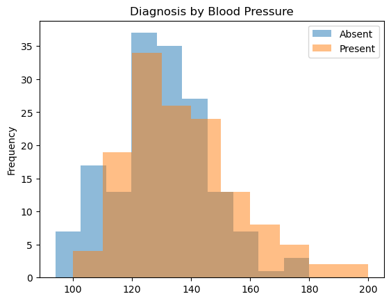
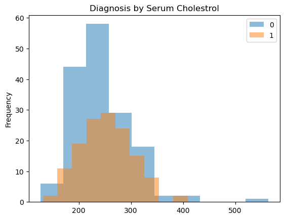
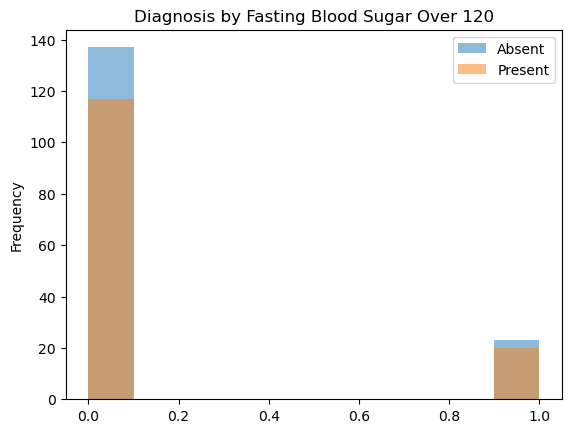

## Scatterplots

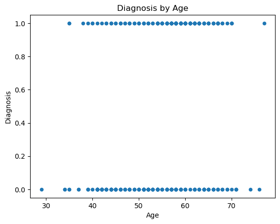
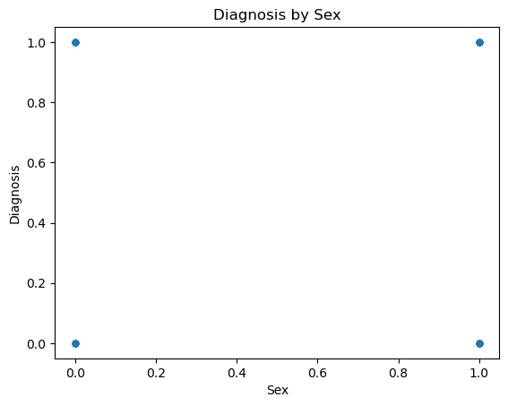
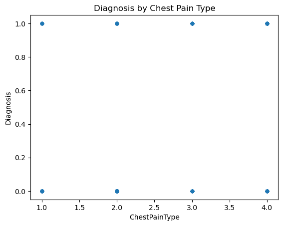
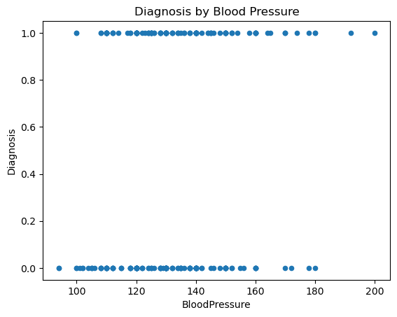
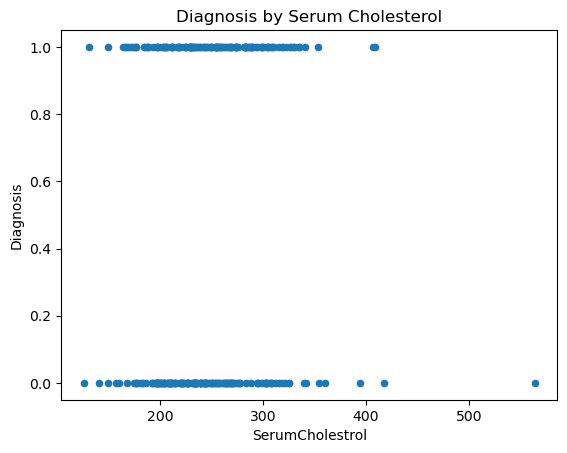
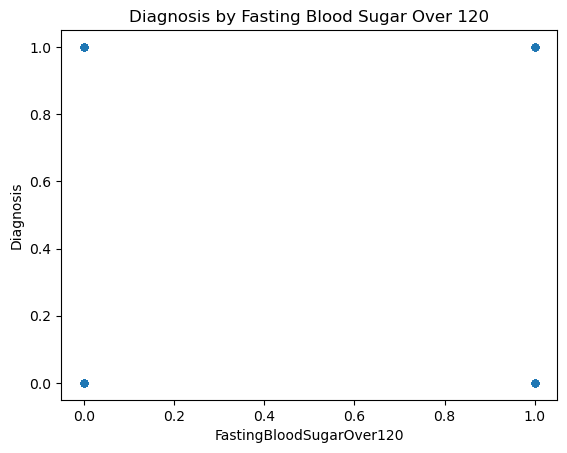

## Trends

Trends according to histogram:

  - Sex: males have a higher incidence of heart-disease.
  - Age: those within the 53-65 range have a higher incidence of heart-disease
    with those in the 60 range having considerably higher incidence to those
    that don't.
  - ChestPainType: those with asymptomatic anginas have a higher incidence of
    heart-disease.
  - BloodPressure: little-to-no difference between those who have and don't have
    heart-disease.
  - SerumCholesterol: doesn't seem to be correlated with heard-disease.
  - FastingBloodSugarOver120: little-to-no difference between those who have and
    don't have heart-disease.
  - ECGAtRest: little-to-no difference between those who have and don't have
    heart-disease when they have left ventricular hypertrophy and ST abnormality.
    However, there is a huge disparity with those with normal ECGs, with there
    being a lower incidence of heart-disease for those with normal ECGs.
  - MaxHeartRate: those with heart rates within 120 to 140 seem to have a higher
    incidence of heart-disease in comparison to those.
  - HasExerciseInducedAngina: doesn't seem to be a positive correlation as the
    frequency of those with heart-disease that also have angina have very little
    difference.
  - STDepression: incidence of heart-disease seems to increase with a higher
    value in comparison to those that don't have heart-disease.
  - STSlope: those with flat slopes have a higher incidence of heart-disease, but
    those with an upslope seem to have a significantly lower incidence of
    heart-disease. The difference between having/not having for downslopes is
    little.
  - FluroscopyMajorVessels: probability of not having heart-disease is inversely
    proportional to this value.
  - Thal: values of 3 show lower incidence, 6 has very little difference, and
    7 has a higher incidence of heart-disease.

## References

  - [https://stackoverflow.com/questions/33303644/pandas-data-frame-find-all-rows-with-particular-column-value]
  - [https://stackoverflow.com/questions/1841565/valueerror-invalid-literal-for-int-with-base-10]
  - [https://stackoverflow.com/questions/23307301/replacing-column-values-in-a-pandas-dataframe]
  - [https://stackoverflow.com/questions/59204445/how-to-do-i-groupby-count-and-then-plot-a-bar-chart-in-pandas]
  - [https://stackoverflow.com/questions/50582168/pandas-get-all-columns-that-have-constant-value]
  - [https://pandas.pydata.org]
  - [https://towardsdatascience.com/discovering-patterns-in-data-with-exploratory-data-analysis-fd07ce1c5efa]
  - [https://www.kaggle.com/code/robikscube/introduction-to-exploratory-data-analysis/notebook]
  - [https://www.youtube.com/watch?v=xi0vhXFPegw]
  - [https://en.wikipedia.org/wiki/Logistic_regression]
